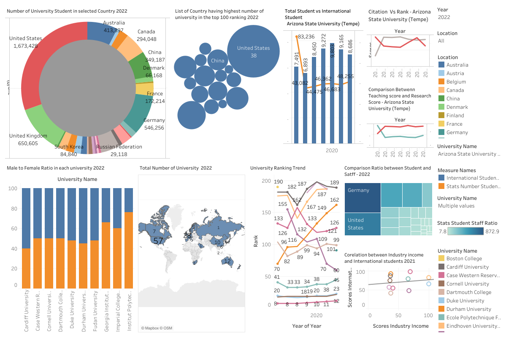

# University Rankings Dashboard



## 📊 Project Overview
This project visualizes the Times Higher Education World University Rankings using Python and Tableau. It includes data cleaning, analysis, and the creation of interactive dashboards.

### 🔗 [View the Interactive Dashboard on Tableau](https://public.tableau.com/app/profile/ajith.sivakumar/viz/DVProjectPhase3/Dashboard2?publish=yes)

## 📝 Features
- **Data Cleaning**: Preprocessing of the rankings dataset to handle missing values.
- **Interactive Visualizations**: Scatter plots and histograms built using Dash and Plotly.
- **Final Dashboard**: A comprehensive dashboard hosted on Tableau for deeper insights.

## 🚀 Getting Started

### Prerequisites
Ensure you have the following installed:
- Python 3.7 or higher
- pip (Python package installer)

### Installation
Clone the repository and navigate to the project directory:
```bash
git clone https://github.com/yourusername/university-rankings-dashboard.git
cd university-rankings-dashboard
